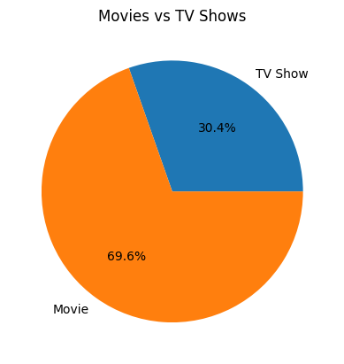
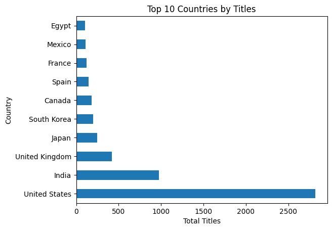
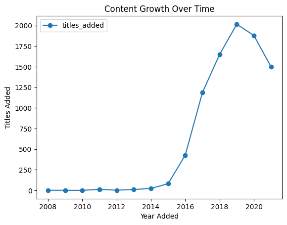
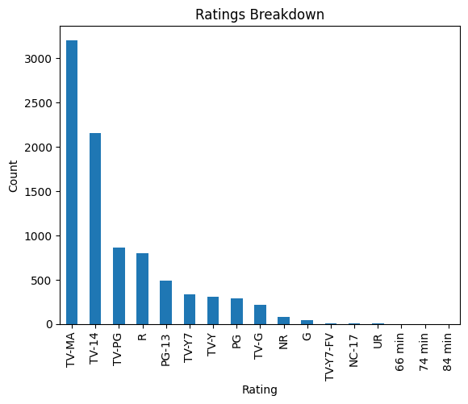
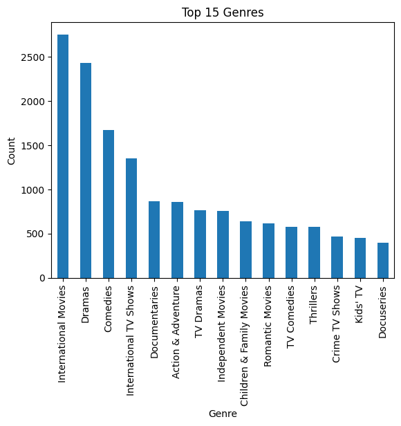

# 🎬 Netflix Data Analysis – BigQuery + Python

## 📌 Overview
This project analyzes the **Netflix Movies & TV Shows dataset (~8,800 titles)** using **SQL in Google BigQuery** and visualizes insights with **Python** in a Kaggle Notebook.

---

## ⚙️ Tools & Skills
- 🗄️ Google BigQuery → SQL queries, data cleaning
- 🐍 Python → Pandas, Matplotlib, Seaborn
- 📓 Kaggle Notebook → visualization & publishing
- 📝 GitHub → project documentation

---

## 📊 Key Insights
- Netflix catalog is ~70% **Movies** vs ~30% **TV Shows**
- **US and India** contribute the most content
- Content additions peaked in **2019**
- **Drama and Comedy** dominate genres
- **TV-MA** is the most frequent rating

---


## 🖼️ Visualizations
  
  
  
  
 


---


## 📂 Repository Structure
```
netflix-data-analysis-bigquery/
├── README.md
├── sql/
├── notebooks/
├── report/
└── images/
```

---

## 📂 Dataset
Dataset is available on Kaggle:  
👉 [Netflix Movies & TV Shows](https://www.kaggle.com/datasets/shivamb/netflix-shows)

---

## 🔗 Links
- 📓 [Kaggle Notebook](https://www.kaggle.com/code/narasimhakasu/netflix-data-analysis-bigquery-python)
- 📁 [GitHub Repository](ADD_YOUR_REPO_LINK_HERE)


## ✅ What I Learned
- Writing production-ready **SQL in BigQuery**
- Performing **data visualization in Python**
- Communicating insights clearly for business audiences
- Creating an **end-to-end data project** (SQL → Python → GitHub)